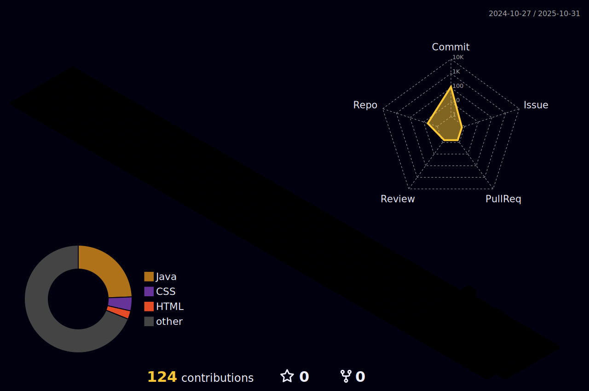

  

 
  <h2 style="border-bottom: 1px solid #d8dee4; color: #282d33;"> 🗃️ Personal Blog </h2>
  

    
  
 

  <h2 style="border-bottom: 1px solid #d8dee4; color: #282d33;"> 🛠️ Tech Stacks </h2>
  
 
    
    
    
    
  

  <h2 style="border-bottom: 1px solid #d8dee4; color: #282d33;"> 🧑‍💻 Contact me </h2>
  
 
    
  

  <h2 style="border-bottom: 1px solid #d8dee4; color: #282d33;">  </h2>

